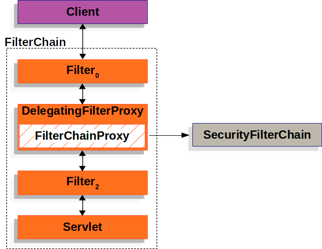

Spring 上下文中有 WebSecurityConfigurerAdapter，则不添加默认配置。

```java
http.authorizeRequests().anyRequest().authenticated().and().formLogin().and().httpBasic();
```


### 密码加密

AuthenticationConfiguration 配置类，配置了 DelegatingPasswordEncoder。

```java
// 创建了多种加密方式，有一个默认方式
PasswordEncoderFactories.createDelegatingPasswordEncoder
```




Spring Security 在 Filter 链中添加了一个过滤器 【**DelegatingFilterProxy**】，然后将链接桥接到了 Spring Security 中去了。

DelegatingFilterProxy 有一个私有变量 Filter ，类型是 FilterChainProxy，一切逻辑通过它处理。在 Filter 初始化或者请求到达的时候，将 FilterChainProxy 赋值给私有变量。


SecurityAutoConfiguration 自动化配置初始化 DelegatingFilterProxy，FilterChainProxy （在 spring context 中，bean name 是 springSecurityFilterChain)。

FilterChainProxy 中有 private List<SecurityFilterChain> filterChains，用于处理请求。FilterChainProxy 在 WebSecurityConfiguration 被初始化。

```java
@Configuration(proxyBeanMethods = false)
public class WebSecurityConfiguration implements ImportAware, BeanClassLoaderAware {
  // 初始化了 FilterChainProxy，WebSecurity.build 出了它。
  @Bean(name = AbstractSecurityWebApplicationInitializer.DEFAULT_FILTER_NAME)
  public Filter springSecurityFilterChain() throws Exception {}
}
```


实现 WebSecurityConfigurerAdapter 的配置类，可以修改 WebSecurity，也可以创建 HttpSecurity 进而多个  SecurityFilterChain 被创建。

```java
@Override
	protected final O doBuild() throws Exception {
		synchronized (this.configurers) {
			this.buildState = BuildState.INITIALIZING;
			beforeInit();
			init();
			this.buildState = BuildState.CONFIGURING;
			beforeConfigure();
			configure();
			this.buildState = BuildState.BUILDING;
			O result = performBuild();
			this.buildState = BuildState.BUILT;
			return result;
		}
	}
```

先配置 HttpSecurity 后配置 WebSecurity。WebSecurityCustomizer 可  WebSecurity。

WebSecurity 控制 FilterChainProxy，有多个  filterChains，private List<SecurityFilterChain> filterChains;

HttpSecurity 控制 filterChains (DefaultSecurityFilterChain) 的创建。

继承 WebSecurityConfigurerAdapter 可以构建一个 DefaultSecurityFilterChain；

```java
public class FilterChainProxy extends GenericFilterBean {
	private List<SecurityFilterChain> filterChains;
}
```

